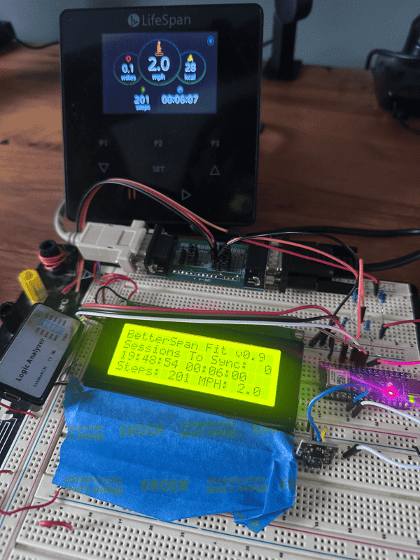

# Treadspan (formerly Better LifeSpan Fit)

Lifespan makes great hardware (Treadmills) but their software is the achilles heel.  It's so close to being an incredible
platform for logging steps. 

This solution solves the biggest limitation of the Lifespan OEM solution.  It enables multiple session logging.  Meaning, 
you can start and stop your treadmill as much as you want and when you want to sync it to AppleHealth you open up the app and 
it'll sync all the sessions done prior.  (You don't have to sync each session individually).

Prior to getting my lifespan, I used to have to remember to put my iphone in my pocket whenever i was on the treadmill so that my steps would get 
counted.  A watch solution doesn't work since your arms are stationary. 

### How it works

OMNI Console ----(BLE) ---> Arduino ----(BLE)----> Mobile App

In order to accomplish this, we need a two part solution: a new piece of hardware and a new mobile app.

First, we program a chip called an Arduino.  This connects to the Omni Console using a Bluetooth Low
Energy (BLE) protocol.  This allows us to know the status of each workout session in realtime and importantly save EACH
session to the arduino's internal memory.  

Next, we install an alternative application to mobile phone which replaces Lifespan Fit app gets installed on your iPhone.  This connects to the Arduino
which is also running a BLE Server and has a custom BLE service that allows the iphone to download each session that was
saved on the device.  

### Mobile App Features
- It's a barebones application that fetches all logged sessions from the Arduino and adds them to HealthKit.  It does this in one step, no need to do the sync to apple health separately. 
- It doesn't require you to login and create an account.  No information is shared.
- It also has some visualizations that are very similar to the step graphs in Apple Health but it'll break out steps taken on your treadmill  
vs. steps logged organically through a watch or iphone.

### Hardware

#### Easy Install
Unless you intend to modify the source code you should do the following:
1. Buy a supported chip. (Arduino Nano ESP32)
2. Install the usb serial drivers. <https://www.silabs.com/developer-tools/usb-to-uart-bridge-vcp-drivers?tab=downloads>
3. Connect the chip to your computer.
4. Go here: https://blak3r.github.io/treadspan-web-installer/ and follow instructions.

#### Setup Arduino Development Environment.
1. Setup the Arduino IDE for ESP32 support. See this guide: <https://randomnerdtutorials.com/installing-the-esp32-board-in-arduino-ide-windows-instructions/>
2. Open the .ino file in the arduino folder.
3. You'll likely need to install a few libraries such as NimBLE.
4. Once you have the environment setup, you can press the Upload button in the IDE.

The chip is powered by USB.  So, you can find an old charger you have laying around and put the chip somewhere out of the way.  It needs to be close to the Omni console but can basically just be in the same room.  
You can wrap the chip in electric tape if you're worried about it touching other metal.

### Mobile App
You'll need to have a Mac, install XCode, do things like create a developer certificate, and put your iphone into developer mode.
It's a fair amount of steps.  If I get enough interest i'll bite the bullet and go through the AppStore process so you don't have to do this.

### Protocol Analysis
If you're interested in learning more about the reverse engineering of protocol attempts. Then, look in the [Protocol Analysis](/protocol-analysis/README.md) folder.
Here I include raw captures of the traffic over both the serial port and BLE as well as my notes from reversing the protocols.

## Contributors Welcome

- Would love some donations, spent at least $200 on an IOS Developer Account to publish to appstore, and evaluating hardware options. (Not to mention probably 50 hours of development)
- Port the iOS App to Android. (AI tools should be able to do most of it)
- The serial port version is likely out of reach for someone who has never used a breadboard before.  If someone wants to create a store and sell assembled hardware, i'll gladly link you! 
- Someone to document the full process of getting XCode setup, a developer certificate, how to put the phone into developer mode.

## Get Help / Support

If you have a question go here: https://github.com/blak3r/treadspan/discussions
If you want to report a bug go here: https://github.com/blak3r/treadspan/issues

## FAQS

### I have an Android Phone, do you have a solution
I haven't tried to make an Android app.  That being said i'm fairly confident if you have any development skills and can use
ChatGPT.  You can get it to make you an app pretty easily by providing the SyncView.swift file and telling it to implement the 
BLE protocol described on this page.

### I have the Retro Console, Can I use this solution?
In theory, yes.  It is possible to get the steps through the serial port.  The downside of this approach is you need 
more complicated hardware and if you're not careful, there is a possibility that you could damage your treadmill if you 
don't connect things correctly.

The hardware is more complicated because you have to create small circuit board that will sniff the serial port traffic.

The approach of using BLE makes the hardware very simple (you just need a programmed arduino). 

### Can I use this in an Office Environment, where there are lots of treadmills?
You would need to modify both the arduino code and mobile app to limit the device it connects with.  This solution 
was designed to make it as easy as possible to get working so it scans for devices matching names... having multiple
treadmill consoles or multiple arduinos programed in range is going to cause unpredicatable/unhandled results. 

### Why does the device require WiFi?

The device needs WiFi solely to maintain an accurate clock via NTP (Network Time Protocol), which is essential for correctly timestamping multiple stored sessions. Believe me, I didn't want to introduce this extra setup step, but it’s necessary to ensure reliable session tracking.

I originally hoped to pull clock information from the Omni console (which does have a built-in clock), but unfortunately, that clock is only for display purposes. When the LifeSpan Fit app retrieves session data from the console, it only provides session durations, not actual start/end timestamps. To integrate with Apple HealthKit, the app estimates these times by setting the end time as the moment you press **"End and Sync"**, then subtracting the session duration to determine the start time.

#### Are there alternatives to using WiFi?

In theory, yes—but each alternative has significant drawbacks:

##### 1. Track elapsed time since startup
- The device could count seconds since power-on and store this in EEPROM. Upon syncing, the mobile app could then estimate session times.
- **Issues**: If power is lost, all stored session timestamps are effectively useless. Additionally, microcontrollers experience clock drift (minutes per day), leading to inaccurate timestamps. This could result in treadmill sessions overlapping with other tracked activities (e.g., walks recorded by your smartwatch).

##### 2. Sync time via the mobile app
- The app could periodically set the device’s clock.
- **Issues**: This would require users to open the app before logging sessions, adding unnecessary friction.

##### 3. Use a real-time clock (RTC) module with a battery
- This would keep time reliably, even if power is lost.
- **Issues**: It would require additional hardware which means novices need to solder or breadboard to make connections! Additionally, it requires an initial time sync to seed the time (similar to WiFi).

#### Why not implement one of these alternatives?

The main reason is accuracy and complexity. These alternatives introduce potential errors or require significant programming effort to make them stable and reliable. I'd rather focus my time on improving other aspects of the project.

That said, if someone finds a better approach and wants to contribute, I'd be happy to accept a pull request!

### Is it possible to control treadmill through mobile app?
I have not found anyway to control the treadmill through the BLE protocol.
It is theoretically possible to write commands to the treadmill via the serial protocol.
But, realistically you can't unless you were willing to sacrifice your existing console and only 
control it through the mobile app (you would also need the more complicated hardware setup and custom firmware).

## TODOs
HIGH
- Create a means to configure the WiFi (with a bluetooth)
- Make BLE code very robust.
- Make BLE session end detection more robust, had issues where it thought it was "unknown";
- Finish UI
- Add means of detecting if EEPROM is initialized.
- Connecting to wifi on TFT.
- Splash screen for TREADSPAN

MED
- Change the bundle id?
- MOBILE app, metrics page
  - Don't allow user to go into future.
  - Sometimes the week view doesn't include the current day.
- Create the FAQ Page Swift View
- WIFI Reconnect code.

LOW
- What would happen if you just turned off the treadmill while a session was active... need something to timeout if no data serial commands or BLE commands come in for a while for a while.
- Need to do a full lcd_clear every once in a while.
- Maybe increase eeprom size to allow for more sessions?
- Change the Service UUIDs to be something less generic that could conflict.
- Could further optimize the serial code to prevent losing commands... but i'm not sure it going to make a difference.

HARDWARE OPTIONS:
- Nano ESP32     , $22 ,  8MB internal, 16mb external, NO BUTTONS, RGB LED though, USB-C, mostly comes unsoldered.
- ESP32-WROOM-32:, $12 , 4MB Internal,  0           , 1 button  , 1 LED         , Micro-B.
- M5 Stamp,        $7.5, 
- M5 is like 39.90 and has 3 buttons.
- HiLetGo makes an 18.99 one here: but only 4megs.https://www.amazon.com/HiLetgo-Display-Bluetooth-Internet-Development/dp/B07X1W16QS?utm_source=chatgpt.com
- $20, 16megs, display, ESP32https://www.amazon.com/LILYGO-T-Display-Arduino-Development-CH9102F/dp/B099MPFJ9M/ref=sr_1_2?crid=IZ9PMD1ZGD2R&dib=eyJ2IjoiMSJ9.hMAQJODb9PtfmmMn9HwTh-KIPBNUzAHWRHaG1ja4pGSe1P1GUNxkh5cv6A5GJf7n-tGp6VRREIdH6dBkeBej2y2kOYkj_1E-RK7nyZvyo1OWaXgR_SSi0D4KFglk3W6eCZAR1tq_bD14DU5PJmfz_XqT58H9SnwYXMcla14Od0aZiGyZKON2z9bmkAzCVcsphxL5R2RMqlACUjtdBon0JrKJhDiv7Txs7hpUO0VBxFIUKycNkJsH4zn_zAw8EW5OQvVEcKw-IM2LSIZnDY7maZAadEb_FaIcsQA5HqT2tUnK0JYxWjAGE9UpIpqyto3KtqoJeVsTiF1lyZq_-FEsUYkZIPbEEiDOHO-hrimas88.Aw7TEb7iuAIKR3u5m-FhLiFgNmqYO55EKp0MaL6yEl0&dib_tag=se&keywords=TTGO%2BT-Display&qid=1739295850&s=electronics&sprefix=ttgo%2Bt-display%2Celectronics%2C113&sr=1-2&th=1
- $17, 16megs, has enclosure + display.