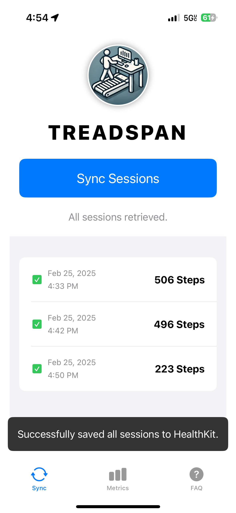

# TreadSpan (an alternative to LifeSpan Fit)

Tracking your steps on a walking pad while working is tricky.  Your hands are stationary on your keyboard so conventional 
step tracking like relying on your watch don't work.  Common workarounds are putting your phone in your pocket 
or putting your watch on your ankle.  I didn't like either option as I frequently end up leaving my phone on my desk after
answering a message and putting my watch on my ankle means giving up your watch and feeling like a convict on house arrest.

When I upgraded my Treadmill, I purchased the [TR1200](https://amzn.to/4bbn8ok) from LifeSpan Fitness, in part 
because the manufacturer had created a mobile app which would allow you to log your steps and it would integrate with HealthKit. 
It sounded like the perfect solution. But, unfortunately the implementation of their mobile app was poor to say the least.
The biggest issue, was you had to open their clunky app to sync every session individually. 
Anytime, I went to the bathroom, answered the door, or grabbed a snack, I'd have to open the app, stop my train of 
thought on what i was doing, and log the steps.  I was baffled, how could my \$1000+ treadmill have a worse experience 
than my \$50 bathroom scale.  My bathroom scale logs my weight each time I step on it and stores each entry to it's 
internal memory. It patiently waits for me to open the mobile app and logs all the entries to HealthKit in one go.

That's what this project aimed todo.  Make my walking pad as convenient as my bathroom scale. 
And with about $20 and 10 minutes of time, you can set this up too and free your mind from the chore of logging your
steps.

__Here's a short demo video__

Everything about this solution is Open Source so the hope is other developers will contribute by writing custom firmware 
for other treadmills over time and they can leverage the mobile app.  

## Instructions

1. Buy this [~$17 chip](https://amzn.to/43eFNhn). (See Hardware section for more options)
2. Install the [USB Serial drivers.](https://www.silabs.com/developer-tools/usb-to-uart-bridge-vcp-drivers?tab=downloads)
3. Load TreadSpan firmware, [using this web based installer](https://blak3r.github.io/treadspan-web-installer/).
5. Install the "TreadSpan" app on your iOS Device from the AppStore.
6. Open the app and follow instructions.

After the firmware is loaded in step 3, you can disconnect the chip from your computer and can power it using any 
old USB-C cable/charger you have laying around.  You don't need to have it even visible on your desk, you could stuff it
in a cable tray under your desk if you really wanted to. 

## Hardware

* [Option 1: comes with a case - LILYGO ESP32 T-Display Module for Arduino CH9102F Chip TTGO Development Board with Shell Version](https://amzn.to/43eFNhn)
* [Option 2: no case - LILYGO ESP32 T-Display Module for Arduino CH9102F Chip TTGO Development Board NO Case](https://amzn.to/43eFNhn)

Version with the case does take a bit longer to ship in my experience, 
As of writing, Feb 2025, the case version is \$17 + 9.50 shipping and the no case version is \$20 with free shipping. 
If you have a 3D printer and are impatient you can print the case [Files available here](https://github.com/Xinyuan-LilyGO/TTGO-T-Display/tree/master/3d_file). 

If the links provided have gone bad, here is what you're looking to buy.
* Brand: LilyGo
* Chipset: ESPRESSIF-ESP32    <-- Notice it does NOT end with S3
* Model: TTGO T-Display
* Flash: 16MB
* Display: IPS ST7789V 1.14 Inch

DO NOT BUY THESE SIMILAR OPTIONS:
* T-Display-S3 AMOLED ESP32-S3 with 1.91 Inch RM67162 Display TTGO Development Board Wireless Module
* T-Display S3 ESP32-S3 1.9-inch ST7789 LCD Display Touchable Screen TTGO Wireless Module Welding Pin Development Board
* T-Display-S3-Long 16MB Flash ESP32-S3 TTGO Development Board with 3.4-inch Touch Display TFT LCD Wireless Modules

Technically, any ESP32 based Arduino should work.  I have loaded it on Arduino ESP32 and The suggested hardware is nice since it has an LCD on it so it'll 
be helpful if you don't have wifi configured properly... or want to know how many sessions are on the device etc.

## Mobile App Features
- It's a barebones application that fetches all logged sessions from the arduino module aka the chip and adds them to HealthKit.  It does this in one step, no need to do the sync to apple health separately.
- It doesn't require you to login and create an account.  No information is shared.
- It also has some visualizations that are very similar to the step graphs in Apple Health but it'll break out steps taken on your treadmill  
  vs. steps logged organically through a watch or iphone.

<table>
<tr>
<td></td>
<td></td>
</tr>
</table>

## How it Works

A bunch of Bluetooth Low Energy protocols.

LS OMNI Console --(BLE)--> "The ESP32 Chip" --(BLE)--> TreadSpan Mobile App

First, the ESP32 Chip mimics the official LifeSpan Fit app to pull the status of the treadmill / how many steps from 
the omni console in realtime.  It detects when sessions starts and stops and saves each session to it's internal memory 
with timestamps. The ESP32 also is running as a BLE Peripheral device that advertises itself to the Mobile App.

Second, the TreadSpan mobile app searches for TreadSpan hardware and will pull any sessions from it.  It then logs those
sessions to Apple HealthKit so your treadmill steps make it's way in.  This allows you to get an accurate view of steps taken
per day from both your treadmill and steps you organically accumulate walking in RL. 

## Development Environment Setups

This section is for developers that want to build the software / tweak things.
I hope that people will write custom firmware for other treadmills that leverage the same BLE protocol so they can leverage
the mobile app without modification.

The source code to the mobile app is available in the ios-app folder.

### Setup Arduino Development Environment.

1. Install Arduino IDE.
2. Setup Arduino IDE for ESP32 support. See [this guide.](https://randomnerdtutorials.com/installing-the-esp32-board-in-arduino-ide-windows-instructions/)
2. Open the treadspan.ino file in the arduino folder.
3. You'll need to install these libraries:
   * Nimble (v2.2.1)
   * TFT_eSPI (2.5.43) - After you install this library, you'll have to edit User_Setup.h and User_Setup_Select.h as shown in [this image](/screenshots/TFT_eSPI_Setup.png).
4. Default Upload Speed of 921600 would not work for me.  I'd get a packet error.  Goto `Tools->Upload Speed` and select `460800`
5. Change the partition Scheme `Tools->Partition Scheme` to `Minimal SPIFFS (1.9MB APP with OTA/190KB SPIFFS)`
6. Depending on your hardware edit `#define`'s at the top of the file. 

### iOS Mobile App

The full source for the mobile app is provided in the `ios-app` folder. You'll need to have a Mac, install XCode, do things like create a developer certificate, and put your iphone into developer mode.  There are plenty of guides on this out there.

### Protocol Analysis
If you're interested in learning more about the reverse engineering of protocol attempts. Then, look in the [Protocol Analysis](/protocol-analysis/README.md) folder.
Here I include raw captures of the traffic over both the serial port and BLE as well as my notes from reversing the protocols.

## Contributors Welcome

- Would love some donations, spent at least $200 on an IOS Developer Account to publish to appstore, and evaluating hardware options. (Not to mention probably 50 hours of development)
- Port the iOS App to Android. (AI tools should be able to do most of it)
- The serial port version is likely out of reach for someone who has never used a breadboard before.  If someone wanted to 
  sell assembled boards 
  hardware for novices i'll gladly link you! 
- Someone to document the full process of getting XCode setup, a developer certificate, how to put the phone into developer mode.

## FAQS

### Is there an Android Version?
No, I'm hoping that someone in the community that has an Android phone will step up and assist. 
I'm fairly confident if you have any development skills and can use
an AI Tool like ChatGPT it wouldn't be difficult to port.  You would providing the SyncView.swift file and telling it to implement the 
BLE protocol.  

### I have the Retro Console, Can I use this solution?
In theory, yes.  It is possible to get the steps through the serial port. I have implemented it and used it for some time.  
The downside of this approach is you need more complicated hardware and if you're not careful, there is a possibility that you could damage your treadmill if you 
don't connect things correctly.

The hardware is more complicated because you have to create small circuit board that will sniff the serial port traffic.

Here's the schematic

Picture showing an early version I wrote that used Arduino ESP32 and a Character LCD.

### Can I use this in an Office Environment, where there are lots of treadmills?
Not supported at the moment, if you want this, please let me know.  it would require adding some additional configuration
options to limit which devices it tries to connect with.  This solution 
was designed to make it as easy as possible to get working so it scans for devices matching names... having multiple
treadmill consoles or multiple arduinos programed in range is going to cause unpredicatable/unhandled results. 

### Why does the device require WiFi?

The device needs WiFi solely to maintain an accurate clock via NTP (Network Time Protocol), 
which is essential for correctly timestamping multiple stored sessions. Believe me, I didn't want to
introduce this extra setup step, but it’s necessary to ensure reliable session tracking. 
See this discussion thread where I outline other options considered: <https://github.com/blak3r/treadspan/discussions/3>

### Is it possible to control treadmill through mobile app?
I have not found anyway to control the treadmill through the BLE protocol.
It is theoretically possible to write commands to the treadmill via the serial protocol.
But, realistically you can't unless you were willing to sacrifice your existing console and only 
control it through the mobile app (you would also need the more complicated hardware setup and custom firmware).

## TODOs (Things actively working on)
HIGH
- Add means of detecting if EEPROM is initialized. 
- Finish the ESP32 Install Page.
- Figure out the timeout preventing it from going directly into wifi setup.
- Create a means to configure the WiFi (over BLE protocol in IOS App).
- Make a setup video.
- See if we can compress space down so partition scheme doesn't need modified.
- Future proof the BLE protocol by adding a few additional options. 
  - Payload Version
  - Ability to include calories, average speed, etc if we wanted to log workouts also. 

MED
- WIFI Reconnect code on Arduino.

LOW
- What would happen if you just turned off the treadmill while a session was active... need something to timeout if no data serial commands or BLE commands come in for a while for a while.
- Maybe increase eeprom size to allow for more sessions?
- Could further optimize the serial code to prevent losing commands... but i'm not sure it going to make a difference.

## Get Help / Support

If you have a question go here: https://github.com/blak3r/treadspan/discussions
If you want to report a bug go here: https://github.com/blak3r/treadspan/issues

