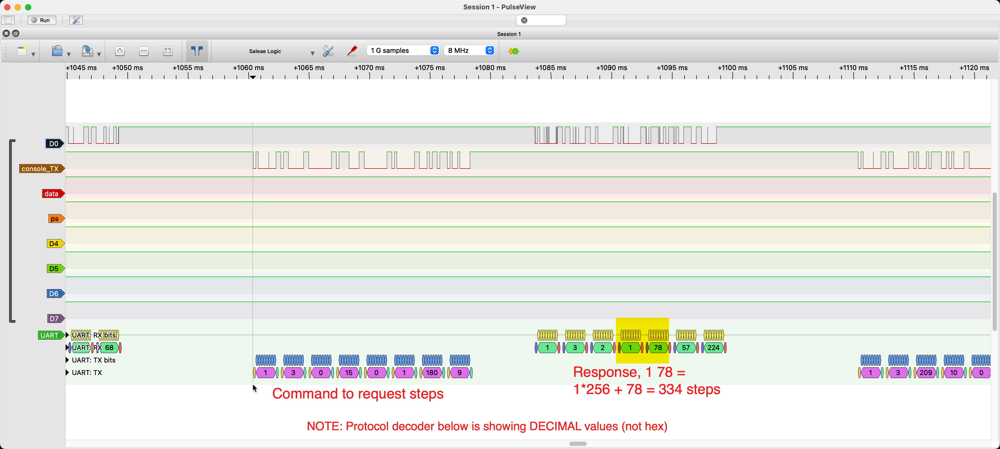

# Serial Protocol Reverse Engineering

This folder contains log files and analysis scripts wrote to reverse engineer the serial protocol between the treadmill
and consoles.  The log files here are for the "Omni Console" and a TR1200B.  Although, I suspect that since the retro
console and the omni console are backwards compatible... they should e substantially similar.  
(But, this remains unconfirmed)

To get this log file, I wrote a Serial Debug mode in the arduino app which output each command received.

## Timestamped Events.

I manually recorded the timestamps of when I pressed various buttons on the console to start and stop the treadmill.
You can use this log here in coordination with <treadmill-serial-comms-log.txt> to further evaluate if you want.

20:29:11 Started Treadmill - 0.4 MPH
20:29:35 Increased speed +0.1 --> 0.5 MPH
20:29:40 Increased speed +0.1 --> 0.6 MPH
20:29:59 Decreased Speed -0.1 --> 0.5 MPH
20:30:25 Pressed Preset #2, increased speed to 1.2 MPH
20:30:40 Pressed Preset #3, increased speed to 2.0 MPH
20:31:20 (No speed changes, but Steps = 91, Calories = 7)
20:31:45 Pressed Pause Button, 125 Steps, 9 Cal, 2:35min elapsed.
20:32:20 Pressed Pause Button again --> Console displays the workout summary.
20:32:36 Pressed Pause Button 3rd time --> Put console into standby (displays clock big)

## Hardware misc
Baud Rate: 4800, 8-N-1
Logic Level, TTL (0-5V);

Pin Label
1   +12V - but only when the console is on / awake.
2   GND
3   Treadmills TX Pin (Omni Console's RX) - It's a UART with TTL (5v logic levels)
4   Treadmills RX PIN (Omni Console's TX) - TTL Logic levels.
5   Yellow 5V, either supply, or data that mostly remains high (multimeter fluctuates from 5.03 to 5.04 V or so)
Not able to comment on 6-9 but don't think it matters it's 3 and 4 that i care about.

In the log files lines that say "REQ  :" are what came in on PIN 4.  The console sends command requests to the treadmill
and the treadmill responds to the requests.  Likewise, `RESP:` lines are what came in on pin 3 and were transmitted from 
the treadmill.

## What I Learned

REQs starting with 1 6 0 10 = are the speed - the treadmill just sends back the exact same payload as like a confirmation.
REQs starting with 1 3 0 15 = STEPS

There are some special commands that happen when you start the treadmill or press pause... 
They do `1 6 0 1` and `1 6 0 2` (see below)... but i found I didn't care about that as you can detect the treadmill is stopped
with `1 6 0 10 0 50 40 29`.  I found that my arduino code was semi unreliable in capturing every single command it would need
a fair amount of optimization to not miss a command every once in a while so relying on the commands that are sent over
and over seemed more reliable.  I do not know what the other commands do but they seem to always be the same so i assume it's
reporting versioning information.  

Steps are computed in the treadmill base. Everything else, like the session time, the speed, the calories are all computed in the console
and not shared over the wire.  

The other commands I don't know... but unfortunately, it doesn't appear that over the wire is:
* Wall time, (the time is set and stored in the console) and is never seems to be shared with treadmill.  It sort of makes sense as i cant see any reason... 
* Calories
* Time of session

## NOTEPAD - my "lab" notes.

20:29:11 - Started the treadmill (startup speed was 0.4).
Time coincides with a unique request of 1 6 0 1
20:29:11 REQ : 1 6 0 1 0 1 25 202
20:29:11 RESP: 1 6 0 1 0 1 25 202

20:31:45 - PAUSED
Got a unique payload also!
20:31:45 REQ : 1 6 0 2 0 1 233 202
20:31:45 RESP: 1 6 0 2 0 1 233 202

20:29:10 REQ : 1 6 0 15 0 0 185 201   <--- tracks with when i
20:31:45 REQ : 1 6 0 15 0 0 185 201   <--- tracks with when i stopped it.
20:31:46 REQ : 1 6 0 15 0 0 185 201
20:31:46 REQ : 1 6 0 15 0 0 185 201

## SPEED CHANGE ANALYSIS

### Pressed UP Arrow to go from 0.4-->0.5
20:29:35 REQ : 1 6 0 10 0 94 40 48
20:29:35 RESP: 1 6 0 10 0 94 40 48
20:29:35 REQ : 1 6 0 10 0 117 104 47
20:29:35 RESP: 1 6 0 10 0 117 104 47

### Increased by pressing +1 to go to 0.6
20:29:40 REQ : 1 6 0 10 0 117 104 47
20:29:40 RESP: 1 6 0 10 0 117 104 47
20:29:40 REQ : 1 6 0 10 0 141 105 173
20:29:40 RESP: 1 6 0 10 0 141 105 173

### Decreased by pressing Minus Arrow (0.6 --> 0.5)
20:29:58 REQ : 1 6 0 10 0 141 105 173
20:29:58 RESP: 1 6 0 10 0 141 105 173
20:29:59 REQ : 1 6 0 10 0 117 104 47
20:29:59 RESP: 1 6 0 10 0 117 104 47

### Pressed Preset button 0.5 --> 1.2
20:30:24 REQ : 1 6 0 10 0 117 104 47
20:30:24 RESP: 1 6 0 10 0 117 104 47
20:30:25 REQ : 1 6 0 10 1 26 41 147
20:30:25 RESP: 1 6 0 10 1 26 41 147

### Preset from 1.2 -> 2.0mph
20:30:40 REQ : 1 6 0 10 1 26 41 147
20:30:40 RESP: 1 6 0 10 1 26 41 147
20:30:40 REQ : 1 6 0 10 1 214 41 198
20:30:40 RESP: 1 6 0 10 1 214 41 198

### STOPPED IT...
20:31:45 REQ : 1 6 0 10 1 214 41 198
20:31:45 RESP: 1 6 0 10 1 214 41 198
20:31:45 REQ : 1 6 0 10 0 50 40 29
20:31:45 RESP: 1 6 0 10 0 50 40 29

Here's another view of the 1 6 0 commands..
55 20:28:59 REQ : 1 6 0 10 0 50 40 29
1 20:29:10 REQ : 1 6 0 10 0 94 40 48
1 20:29:10 REQ : 1 6 0 15 0 0 185 201
1 20:29:11 REQ : 1 6 0 10 0 94 40 48
1 20:29:11 REQ : 1 6 0 1 0 1 25 202
123 20:29:11 REQ : 1 6 0 10 0 94 40 48
25 20:29:35 REQ : 1 6 0 10 0 117 104 47
93 20:29:40 REQ : 1 6 0 10 0 141 105 173
130 20:29:59 REQ : 1 6 0 10 0 117 104 47
79 20:30:25 REQ : 1 6 0 10 1 26 41 147
326 20:30:40 REQ : 1 6 0 10 1 214 41 198
1 20:31:45 REQ : 1 6 0 10 0 50 40 29
1 20:31:45 REQ : 1 6 0 15 0 0 185 201
1 20:31:45 REQ : 1 6 0 10 0 50 40 29
1 20:31:45 REQ : 1 6 0 2 0 1 233 202
1 20:31:46 REQ : 1 6 0 10 0 50 40 29
1 20:31:46 REQ : 1 6 0 15 0 0 185 201
1 20:31:46 REQ : 1 6 0 10 0 50 40 29
1 20:31:46 REQ : 1 6 0 15 0 0 185 201

